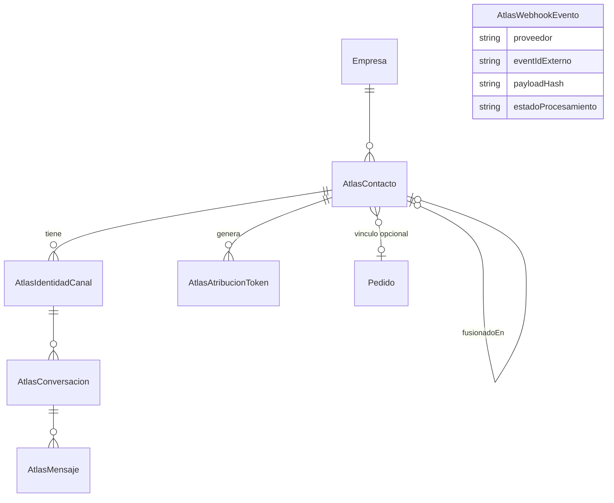

# ATLAS — núcleo técnico del futuro módulo Comercial

Captura, clasifica y da seguimiento a leads que escriben por Instagram,
WhatsApp, Facebook, TikTok o el catálogo público — antes de que exista un
Pedido.

**Desde la Subfase 0.2 (2026-07-31), ATLAS ya no se piensa como un módulo
aislado**: es el motor de Inbox/Leads/Contactos de un ecosistema más
amplio, **Comercial**, que también incluirá Campañas, Automatizaciones,
Seguimientos, Embudos y Reportes, y que absorberá al CRM actual (sin
duplicar nada). Ver [ARQUITECTURA_COMERCIAL.md](./ARQUITECTURA_COMERCIAL.md)
para el mapa completo pilar-por-pilar.

**Estado actual: fundación técnica corregida, pendiente de aplicar contra
la base real.** No hay ningún canal conectado todavía. No se envía ningún
mensaje real. Ver [VISION.md](./VISION.md) para el propósito de negocio y
los dos principios permanentes del proyecto (arquitectura aprobada antes
de implementar; ATLAS nunca decide operativa ni financieramente), y
[DECISIONES.md](./DECISIONES.md) / [ROADMAP.md](./ROADMAP.md) para el
resto del plan técnico.

## Por qué existe (y por qué no es lo mismo que "CRM")

El ERP ya tiene una entrada de navegación llamada "CRM"
(`client/src/pages/crm/CrmDashboard.jsx`), pero esa es identidad de
**facturación** (`Cliente` en `schema.prisma`): solo existe una vez que un
Pedido ya se facturó. ATLAS resuelve un problema distinto y anterior: el
cliente escribió "catálogo" por Instagram hace tres días y todavía nadie le
respondió. Por eso ATLAS tiene sus propios modelos — nunca reutiliza ni se
fusiona con `Cliente`.

## Persona vs. identidad por canal (corrección 0.1.1)

La misma persona puede escribirle a Panaprice por Instagram, después por
WhatsApp y después comprar en el catálogo. ATLAS separa deliberadamente:

- **`AtlasContacto`** — la PERSONA: un solo registro por lead real,
  independiente de cuántos canales use.
- **`AtlasIdentidadCanal`** — cada canal por el que esa persona escribió
  (Instagram, WhatsApp, catálogo...), con su propio identificador externo,
  su propio estado de suscripción/consentimiento y su propio historial de
  conversación.

Un `AtlasContacto` tiene **muchas** `AtlasIdentidadCanal`. La unión entre
identidades nunca es automática por nombre parecido — solo por coincidencia
fuerte (teléfono/email ya validado) o por fusión manual auditada (ver
`fusionarContactos()` en `contactos.service.js`). Detalle completo en
[DECISIONES.md](./DECISIONES.md).

## Diagrama (modelo de datos)



`AtlasWebhookEvento` queda deliberadamente sin relación en el diagrama: es
una tabla técnica de deduplicación, no sabe a qué contacto pertenece un
evento hasta procesarlo (ver `idempotencia.service.js`).

## Dónde vive el código

```
server/src/services/atlas/
  config.js                  constantes (canales, estados, palabras de salida...)
  contactos.service.js       resolución de identidad + fusión manual auditada
  identidades.service.js     verificación, consentimiento y baja POR CANAL
  conversaciones.service.js  historial de mensajes (cuelga de una identidad)
  intents.service.js         clasificador por reglas + detección de opt-out
  respuestas.service.js      plantillas de respuesta
  seguimientos.service.js    recordatorios pendientes
  metricas.service.js        analytics de lectura
  atribucion.service.js      tokens públicos opacos (?ref=...)
  idempotencia.service.js    dedup de webhooks
  integraciones/             adaptadores por proveedor (hoy: stubs vacíos)
server/src/routes/atlas.routes.js          API autenticada (staff, client/)
server/src/routes/atlasWebhooks.routes.js  receptores públicos (creado, SIN montar)
client/src/pages/atlas/                    UI del ERP
```

No existe una carpeta `atlas/` propia en la raíz del proyecto: el código
sigue la convención real de Grupo Blanco OS (archivos planos con nombre
descriptivo dentro de `services/`, `routes/`, `pages/`), no una estructura
anidada por concepto.

## Regla de oro

Ningún módulo de ATLAS modifica archivos de Finanzas, Producción,
Inventario o Compras. Toda integración futura con esos módulos pasa por
eventos ya existentes (`PEDIDO_FACTURADO`, `SOLICITUD_CONVERTIDA`) o por
eventos nuevos que ATLAS emite (`ATLAS_*`, ver `server/src/events/eventos.js`)
— nunca por edición directa de sus servicios.
